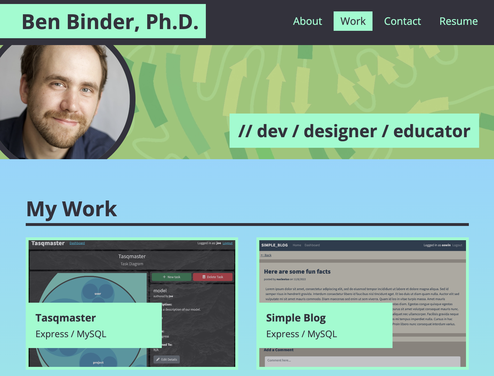

# React Dev Portfolio
Enhanced version of the dev portfolio created earlier in the course with basic HTML/CSS. Built using React. The following features are implemented in accordance with the challenge criteria:

- Use of **Create React App** to template the necessary app structure.
- Use of **componentized structure** to take advantage of reusable elements.
- Multiple "pages" enabled through conditional rendering on a single page.
- Use of **React hooks** to control page states and form submission via **state variables**.

Extra features included for completeness and UX considerations include:
- A responsive, mobile-friendly UI built using **Tailwind CSS**.

&nbsp;

## Usage

The page can be viewed [here](https://binderb.github.io/react-dev-portfolio/) on GitHub Pages. Users can navigate to the various sections of the portfolio site using the nav links, which are tied to state variables and prompt the rendering of different content.

## Credits

All code for this exercise was written by the developer, with general criteria supplied by the UofM Coding Bootcamp (Trilogy Education Services).

## License

Please refer to the LICENSE in the repo.